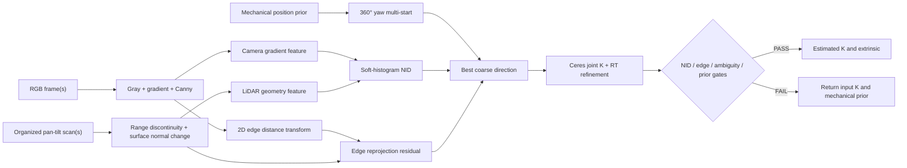

# Calibration Core 아키텍처 및 검증 가이드

## 1. 구현 상태

현재 구현은 Ubuntu native 개발 환경에서 동작하는 **Calibration Core MVP**다.
Stanford 2D-3D-Semantics의 RGB/depth로 생성한 가상 pan-tilt LiDAR scan을 입력으로 사용하며,
카메라와 LiDAR 사이의 6-DoF 외부 파라미터를 추정한다.

- 단일 장면 API와 다중 장면 공동 최적화 API 구현
- RGB gradient magnitude와 Canny edge 추출
- organized LiDAR range discontinuity와 surface-normal 변화량 추출
- soft-histogram Normalized Information Distance(NID)와 edge 거리의 복합 목적함수
- 15° 간격 360° yaw multi-start 후 Ceres 기반 6-DoF refinement
- 기계 설계값(mechanical prior) 정규화
- 입력 품질, NID 중첩·개선률, multi-start 모호성, 이동량 품질 게이트
- 불합격 후보를 외부로 내보내지 않고 입력 prior를 반환하는 fail-safe 계약
- 합성 ground truth를 이용한 conformance CLI 및 JSON 결과

OpenSDK/CV5 이식과 실제 actuator 데이터 취득은 이 구현 범위에 포함하지 않는다.

## 2. 좌표계 계약

외부 파라미터는 다음 식으로 고정한다.

```text
p_camera = R_camera_lidar * p_lidar + t_camera_lidar
```

- 거리 단위: meter
- 각도 내부 단위: radian
- 보고서 회전 오차: degree
- 카메라 좌표: OpenCV optical frame (`+x` right, `+y` down, `+z` forward)
- LiDAR 점은 actuator의 pan/tilt 광선에 따라 organized scan으로 저장

좌표계 방향이나 parent/child frame을 바꾸면 결과가 수치상 정상처럼 보여도 반대 변환이 된다.
실장 연동 시 이 계약을 adapter 경계에서 반드시 확인한다.

## 3. 처리 흐름

아래 흐름은 최종 보정에 사용하는 다중 장면 API 기준이다. 단일 장면 API는 빠른 입력 진단을 위해 기존 edge-only 경로를 유지한다.



### RGB feature

1. RGB를 grayscale로 변환한다.
2. Sobel gradient magnitude를 계산하고 Gaussian blur로 약간 확장한다.
3. 영상마다 평균과 표준편차로 0~1 범위에 정규화한다.
4. Canny edge의 distance transform도 별도로 생성한다.

Gradient feature는 NID 입력이고, distance transform은 정확한 경계 위치를 맞추는 보조 잔차다.

### LiDAR geometry feature

organized scan의 각 유효 cell에서 두 값을 계산한다.

- 수평·수직 이웃과의 range 차이가 threshold를 넘는 정도
- 좌우·상하 점으로 계산한 surface normal이 이웃 normal과 달라지는 각도

두 값 중 큰 값을 0~1 geometry feature로 사용한다. 평면 내부의 낮은 값에 histogram이 묻히지 않도록 feature 값 구간별로 균형을 맞춰 장면당 최대 5,000점을 결정적으로 샘플링한다. 원시 `signal_strength`는 현재 유효성 필터에만 사용하며 NID 입력에는 넣지 않는다.

### 3D 평면과 구조선 추출

구조선 항은 raw range discontinuity를 곧바로 선으로 쓰지 않는다. 그 방식은 벽-바닥
교차선뿐 아니라 책상, 의자, 사람, 센서 노이즈의 실루엣까지 같은 종류의 선으로 만들기
때문이다. 현재 구현 순서는 다음과 같다.

1. organized scan의 상하·좌우 이웃 중 range discontinuity가 아닌 점만 사용해 one-sided
   surface normal을 계산한다. 경계 반대편 점으로 normal을 만들지 않는다.
2. 이웃 normal 각도 15° 이내, 이웃의 접평면 거리 40 mm 이내인 cell을 4-neighbor region
   growing으로 묶는다.
3. 80점 이상이고 두 번째 축의 추정 extent가 150 mm 이상인 영역에 PCA 평면을 맞춘다.
   point-to-plane RMS가 30 mm를 넘으면 평면으로 승인하지 않는다.
4. 승인 평면에 인접한 미분류 점을 normal과 point-to-plane 거리로 재할당하고, 서로
   이웃하면서 normal·offset이 같은 평면 조각을 병합한다.
5. IMU 수평 gate로 `+Y down`이 보장되는 좌표 계약을 사용해 수직 normal 점을 높이별로
   다시 묶는다. region growing에서 잘린 바닥·책상 상판 같은 수평면의 보완 경로다.
6. 경계 normal이 승인되지 않아 생기는 얇은 미분류 띠를 고려해 organized grid 3-cell
   반경에서 승인 평면 쌍을 찾는다. 두 평면 각도가 20° 이상이고, 중복을 제거한 관측
   경계점 중 수학적 교차선 100 mm 이내의 지지점이 8개 이상일 때 그 inlier만으로
   유한 교차선의 양 끝을 정한다.
7. 150 mm 이상의 평면 교차선만 2D LSD 선분과 비교한다. raw range discontinuity 선은
   `occlusion edge`로 별도 저장하며 현재 목적함수에는 넣지 않는다.

따라서 `surface normal`, `plane label`, `plane intersection`, `occlusion silhouette`,
`calibration input edge`를 각각 확인할 수 있다. 장애물 표면 자체가 충분히 평평하면 별도
평면으로 검출되는 것은 정상이다. 다만 그 장애물과 다른 평면의 교차선은 실제 지지 경계가
있을 때만 구조선 후보가 된다.

### NID와 edge 복합 목적함수

투영된 LiDAR geometry feature와 해당 영상 위치의 gradient feature로 16×16 soft joint histogram을 만든다. 한 샘플을 인접 bin에 선형 분배하므로 자세나 focal length가 조금 바뀔 때 비용도 급격히 끊기지 않는다.

```text
NID = 1 - MI(L, C) / H(L, C)
J   = 0.70 * NID² + 0.30 * normalized_edge_distance²
```

- `MI(L,C)`: LiDAR geometry와 camera gradient의 mutual information
- `H(L,C)`: 두 특징의 joint entropy
- NID는 작을수록 두 특징의 통계적 정합이 좋다.
- Edge는 위치 정밀도를 보완하지만 단독 PASS 근거로 쓰지 않는다.

다중 장면은 동일한 `R,t,fx,fy,cx,cy`를 공유한다. Ceres numeric differentiation으로 NID와 edge 잔차를 함께 줄이고 mechanical prior는 과도한 평행이동과 비현실적 해를 억제한다.

### 360° yaw multi-start

초기 heading을 작업자가 정확히 입력하지 않아도 되도록 LiDAR 수직축 기준 -180°부터 165°까지 15° 간격의 24개 후보를 먼저 평가한다. 가장 낮은 복합 목적함수 후보에서 refinement를 시작한다. 멀리 떨어진 두 방향의 점수가 2% 이내이면 방향을 구분할 증거가 부족한 것으로 보고 `MULTISTART_AMBIGUOUS`로 거절한다.

### Optical-axis down × yaw 2차원 초기 탐색

실데이터 실행기는 채널 공통 `roll=90°`를 사용하지 않는다. 별도 장착 각도 입력이 없으면 down 0~90°를 15° 간격으로 만들고, 각 down 후보마다 위 24개 yaw 후보를 평가한다. 점수 상위 5개는 투영 이미지와 후보 RT로 저장한다. 단일 관측에서는 제조사 FOV 기반 K를 고정하고 이 탐색을 수행하되, 결과를 활성화하지 않고 `SINGLE_OBSERVATION_DIAGNOSTIC_ONLY`로 강제 실패시킨다. 3개 이상 관측에서만 K와 RT 공동 최적화 및 PASS 판정을 허용한다.

투영 시 카메라 깊이 기준 z-buffer를 만들고 최근접 표면에서 10 mm보다 뒤에 있는 점은 2D/색상 PLY 출력에서 제외한다. `mechanism.tilt_zero`는 기구축 홈 메타데이터로만 기록하며 좌표 계산에는 `measurements[].tilt_rad`와 JSON `frame` 계약을 사용한다. 지원하지 않는 handedness/convention은 입력 단계에서 거절한다.

현재 z-buffer는 산출물 시각화에만 적용되어 목적함수와 가시점 집합이 다르다. 다음 변경은
coarse 후보별로 동일한 z-buffer를 적용해 보이는 구조점만 점수화한다. Ceres refinement는
현재 RT에서 가시 집합을 고정한 내부 최적화와 z-buffer를 갱신하는 외부 반복으로
구성한다. 매 잔차 평가마다 z-buffer를 바꾸지 않아 목적함수의 불연속을 피한다.

구조선 보조항은 OpenCV LSD의 긴 2D 선분과 organized cloud의 주요 평면 교차선을
대응한다. 잔차는 투영선의 수직거리, 방향차, 겹치는 길이로 구성하며, 구조선 증거가
부족하면 해당 항을 비활성화하고 진단 사유를 남긴다. JSON schema 메타데이터 보강은
향후 권장사항이며 이 목적함수 변경의 선행조건이 아니다.


### Pan/Tilt sweep과 방향 후보의 구분

실제 LiDAR 변환식 `x=d cos(tilt) sin(pan)`, `y=-d sin(tilt)`, `z=d cos(tilt) cos(pan)`에서 pan 회전축은 `+Y`이다. 따라서 Core의 yaw multi-start(`UnitY`)는 pan 축과 기하학적으로 같은 축을 탐색한다. 그러나 pan 360° sweep은 측정 데이터의 방위각 범위이고 yaw multi-start는 카메라와 LiDAR 사이 외부 회전 후보이므로 동일한 동작이 아니다. 평면·대칭 장면에서는 360° 데이터를 가져도 yaw가 관측되지 않을 수 있다.

실행기의 down 후보는 카메라 optical axis 초기 회전 후보이며 JSON의 tilt 샘플을 그대로 복사한 값이 아니다. 현재 기본값은 0~90°를 15° 간격으로 탐색한다. 따라서 producer가 `tilt_zero`와 실제 `tilt=0/-90°` 광선 방향을 확정하기 전에는 후보 방향을 정답 RT로 해석하지 않는다. `tilt_zero`가 `forward`와 다르면 입력을 거절하고, 명시적 override는 진단 결과에만 허용한다.

## 4. 공개 API

탐색 간격과 인접 후보 보정의 선정 절차는
[Yaw–Roll 탐색 간격 시험 계획](ORIENTATION_SEARCH_STEP_SIZE_TEST_PLAN.md)을 따른다.

헤더: `include/auto_calib/calibration_core.hpp`

```cpp
auto result = auto_calib::calibrateExtrinsic(
    bgr, camera, scan, mechanical_prior, config);
```

단일 장면의 빠른 진단용 API다. 텍스처가 많은 장면에서는 잘못된 edge 최소점이 생길 수
있으므로 최종 보정값 산출에는 다중 장면 API를 권장한다.

```cpp
std::vector<auto_calib::CalibrationObservation> observations;
// 서로 다른 구조와 시점을 가진 RGB + organized scan을 추가한다.
auto result = auto_calib::calibrateExtrinsicMultiScene(
    observations, mechanical_prior, config);
```

모든 장면에서 동일한 외부 파라미터 하나를 공동 최적화한다.
`optimize_camera_intrinsics=true`이면 장면들이 공유하는 `fx,fy,cx,cy`도
제한된 범위에서 함께 최적화한다. 실제 시스템에서는 센서가 강체로 고정되고
zoom/focus/LDC가 유지된 상태에서 서로 다른 벽, 문틀, 가구 경계를 포함한 장면
5개 이상을 사용한다.

주요 결과 필드는 다음과 같다.

| 필드 | 의미 |
|---|---|
| `success` | Core 품질 게이트 통과 여부 |
| `reason_code` | `PASS` 또는 거절 원인 |
| `estimated_t_camera_lidar` | 통과 시 후보, 실패 시 입력 mechanical prior |
| `estimated_camera` | 통과 시 공동 추정 K, 실패 시 입력 K |
| `candidate_camera` | 품질 게이트 전 진단용 K 후보 |
| `metrics.projected_ratio` | 전체 LiDAR edge 중 영상에 유효 투영된 비율 |
| `metrics.lidar_geometry_points` | NID에 사용한 range/normal 특징 점 수 |
| `metrics.lidar_planes` | 승인된 3D 평면 수 |
| `metrics.lidar_structural_segments` | 목적함수에 사용한 평면 교차선 수 |
| `metrics.lidar_occlusion_segments` | 진단 전용 range-discontinuity 실루엣 수 |
| `metrics.initial_nid`, `final_nid` | 초기·최종 Normalized Information Distance; 작을수록 좋음 |
| `metrics.nid_projected_points` | 최종 자세에서 영상 내부에 투영된 NID 특징 점 수 |
| `metrics.initial_composite_objective`, `final_composite_objective` | NID와 edge를 정규화해 합친 품질값 |
| `metrics.multistart_objective_margin` | 서로 떨어진 1·2위 yaw 후보의 상대 점수 차이 |
| `metrics.initial_mean_edge_distance_px` | prior에서의 평균 edge 거리 |
| `metrics.final_mean_edge_distance_px` | 최적화 후보에서의 평균 edge 거리 |
| `metrics.objective_improvement_ratio` | 복합 목적함수의 `(initial-final)/initial`; 양수일수록 개선 |
| `solver_summary` | Ceres 종료 요약 |

## 5. Fail-safe 및 품질 게이트

아래 조건 중 하나라도 만족하지 못하면 `success=false`다.

- 유효한 camera intrinsic
- intrinsic 공동 추정 시 최소 3관측 및 동일 해상도
- focal/principal point 탐색 경계 내부 해
- 유효한 NID histogram·가중치·normal threshold 설정
- 최소 camera edge 수
- 장면별 최소 LiDAR edge 수
- 장면별 최소 LiDAR geometry feature 수와 최종 NID 투영 수
- 서로 떨어진 yaw 후보 간 최소 목적함수 margin
- 최소 영상 투영 중첩률
- 최대 평균 edge 거리
- 설정된 최소 복합 목적함수 개선률과 NID 개선률
- prior 대비 최대 회전/평행이동 허용량
- Ceres가 사용할 수 있는 해를 생성하고 `CONVERGENCE`로 종료

실패한 최적화 후보는 `estimated_t_camera_lidar`에 저장하지 않는다. 호출자는 실패 시에도
잘못된 보정값을 actuator나 후단 perception에 적용하지 않고 기존 mechanical prior를
계속 사용할 수 있다.

합성 CLI의 `status`는 Core 성공뿐 아니라 ground-truth 허용오차까지 통과해야 `PASS`다.
`core_status=PASS`, `status=FAIL`이면 수학적 최적화는 끝났지만 정확도 규격은 충족하지
못했다는 뜻이다.

## 6. 빌드와 테스트

`develop` 폴더에서 Ubuntu native로 실행한다. 의존성이 없다면 먼저
`./scripts/install-ubuntu-deps.sh`를 한 번 실행한다.

```bash
cmake \
  -S . -B build -G Ninja \
  -DCMAKE_BUILD_TYPE=RelWithDebInfo
cmake --build build --parallel 2
ctest --test-dir build --output-on-failure
```

현재 단위 테스트는 다음을 검증한다.

- synthetic pan-tilt scan 생성과 재현성
- LiDAR range edge 추출
- 직교 평면의 분할과 유한 교차선 추출
- 서로 떨어진 평행면을 교차선으로 오인하지 않고 폐색선으로 분리
- 단일 장면 최적화
- 다중 장면 공동 최적화
- geometry NID 특징 생성·투영과 유한한 NID 결과
- 180° 잘못된 초기 heading의 360° yaw multi-start 복구
- blank RGB 입력 거절
- 과도한 후보 이동 거절 및 prior fallback
- 최소 objective 개선률 미달 거절
- 공동 intrinsic 최소 관측 수 및 유효 추정
- pose error 계산

## 7. Stanford 다중 장면 conformance 실행

아래 명령은 서로 다른 공간 5개를 사용한다.

```bash
build/bin/run_multi_synthetic_calibration \
  --dataset-root /path/to/area_1 \
  --output automatic_calibration/generated/calibration_core_multi_geometry_nid_validation \
  --frame-ids \
camera_0004591bfdc749a88db196a5d8b345cb_office_6_frame_0,camera_00d10d86db1e435081a837ced388375f_office_24_frame_0,camera_03eb3fa2e1524ee887ba22d1a4896f3c_WC_1_frame_0,camera_042a479869b44a7c9159922f19a285ea_conferenceRoom_1_frame_0,camera_042fab82b3a94af9bea3c80984bc2583_hallway_2_frame_0
```

2026-08-11 geometry NID 검증 결과:

| 항목 | 결과 |
|---|---:|
| 장면 수 | 5 |
| 초기 회전 오차 | 2.7533° |
| 최종 회전 오차 | 2.7223° |
| 초기 평행이동 오차 | 0.03536m |
| 최종 평행이동 오차 | 0.03534m |
| 허용오차 | 회전 3.0°, 평행이동 0.05m |
| 전체 LiDAR edge | 5,871 |
| LiDAR geometry feature | 11,063 |
| initial → final NID | 0.98985 → 0.98938 |
| 복합 목적함수 개선률 | 0.2945% |
| projected ratio | 0.6524 |
| runtime | 1,268.1ms |
| conformance | PASS |

결과 JSON은
`generated/calibration_core_multi_geometry_nid_validation/calibration_result.json`에 생성된다.
허용오차 내 PASS지만 개선 폭이 작으므로 구현 회귀 확인으로만 사용한다. 실제 장비 실행기는
복합 목적함수 5%, NID 1%, multi-start margin 2%를 요구하며 독립 reference/hold-out 검증 전에는
활성 보정값으로 승인하지 않는다.

단일 장면 기본 검증은 회전 오차는 줄였지만 평행이동 오차가 0.06166m여서 정답 허용오차
0.05m를 넘었고 `GROUND_TRUTH_TOLERANCE_EXCEEDED`로 정상적으로 실패한다. 이 결과 때문에
단일 장면은 최종 보정 경로가 아니라 입력/기능 smoke test로 분류한다.

## 8. 실제 actuator 연결 시 adapter 경계

Core는 데이터 취득 장치와 분리되어 있다. 실제 actuator가 완성되면 합성 생성기만 아래
adapter로 교체하고 Core API는 유지한다.

1. pan/tilt encoder 각도와 1D LiDAR range를 `Scan`의 row/column 순서로 변환
2. 카메라 timestamp와 scan sweep 기준 timestamp 동기화
3. invalid range, saturation, actuator 정지/가속 구간을 quality flag로 제거
4. 고정된 resolution/zoom/focus/LDC 상태의 원본 영상과 제조사 FOV 기반 초기 K를 Core에 전달
   하고, 수동 intrinsic 파일 없이 다중 장면에서 K와 RT를 공동 추정
5. 최소 5개의 서로 다른 장면을 모아 `calibrateExtrinsicMultiScene` 호출
6. `success=true`와 현장 정확도 검증을 모두 통과한 경우에만 보정값 저장

## 9. 현재 한계와 완료 조건

현재 Core는 합성 conformance 개발과 API 통합을 진행할 수 있는 MVP이며, 양산 완료 상태는
아니다. 다음 항목이 실제 장비에서 확인되어야 Calibration Core production 완료로 판정한다.

- 실제 actuator의 encoder/range 시간 동기화
- 카메라 distortion 및 rolling-shutter 영향 반영
- 기구 공차 기반 prior sigma 재산정
- 장면 자동 선별과 관측성/퇴화 판정
- 실제 target 또는 측량 ground truth 정확도 검증
- 반복 측정 분산, 온도 변화, 진동에 대한 weekly endurance 검증
- OpenSDK/CV5 adapter 및 성능 검증(사용자 진행 범위)

## 10. 코드 맵

| 파일 | 역할 |
|---|---|
| `include/auto_calib/calibration_core.hpp` | 설정, 결과, 단일/다중 공개 API |
| `src/calibration_core.cpp` | feature 추출, Ceres 최적화, 품질 게이트 |
| `apps/run_synthetic_calibration.cpp` | 단일 Stanford 합성 conformance CLI |
| `apps/run_multi_synthetic_calibration.cpp` | 다중 Stanford 합성 conformance CLI |
| `tests/calibration_core_tests.cpp` | Core 단위 및 fail-safe 회귀 테스트 |
| `generated/.../calibration_result.json` | 실행별 machine-readable 결과 |
