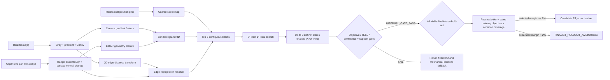

# Calibration Core 아키텍처 및 검증 가이드

> 현재 MVP 제품 운용 정책은 [`PRODUCT_CALIBRATION_POLICY.md`](PRODUCT_CALIBRATION_POLICY.md)를
> 우선한다. 이 문서의 과거 K+RT 공동 추정·제조사 FOV 초기화 설명은 연구/진단 API의
> 동작을 설명하는 것이며 제품 승인 경로를 의미하지 않는다.

## 1. 구현 상태

현재 구현은 Ubuntu native 개발 환경에서 동작하는 **Calibration Core MVP**다.
Stanford 2D-3D-Semantics의 RGB/depth로 생성한 가상 pan-tilt LiDAR scan을 입력으로 사용하며,
카메라와 LiDAR 사이의 6-DoF 외부 파라미터를 추정한다.

- 단일 장면 진단 API와 다중 장면 공통 `R,t` 최적화 API 구현
- 동일 camera profile의 Manual ChArUco `K + distortion` 고정 및 raw 영상 undistort
- RGB gradient magnitude와 Canny edge 추출
- organized LiDAR range discontinuity와 surface-normal 변화량 추출
- soft-histogram Normalized Information Distance(NID)와 edge 거리의 복합 목적함수
- staged 방향 탐색: coarse score map → 상위 3개 contiguous basin → 5° local search →
  1° local search
- 서로 분리된 최대 3개 finalist에 Ceres 기반 6-DoF `R,t` refinement
- objective 유의차 → near-tie TESL → confidence 계층 선택과 dual-margin ambiguity gate
- 기계 설계값(mechanical prior) 정규화
- 입력 품질, NID 중첩·개선률, multi-start 모호성, 이동량 품질 게이트
- 불합격 후보를 외부로 내보내지 않고 입력 prior를 반환하는 fail-safe 계약
- `INTERNAL_GATE_PASS`, `CANDIDATE_RT`, `PRODUCT_APPROVED_RT` lifecycle 상태 분리
- Manual RT 주변 ±1/3/5/10° perturbation을 평가하는 reference conformance 도구
- 합성 ground truth를 이용한 conformance CLI 및 JSON 결과

OpenSDK/CV5 이식과 실제 actuator 데이터 취득은 이 구현 범위에 포함하지 않는다.

## 2. 좌표계 계약

외부 파라미터는 다음 식으로 고정한다.

```text
p_camera = R_camera_lidar * p_lidar + t_camera_lidar
```

- 거리 단위: meter
- 각도 내부 단위: radian
- 보고서 회전 오차: degree
- 카메라 좌표: OpenCV optical frame (`+x` right, `+y` down, `+z` forward)
- LiDAR 점은 actuator의 pan/tilt 광선에 따라 organized scan으로 저장

좌표계 방향이나 parent/child frame을 바꾸면 결과가 수치상 정상처럼 보여도 반대 변환이 된다.
실장 연동 시 이 계약을 adapter 경계에서 반드시 확인한다.

## 3. 처리 흐름

아래 흐름은 최종 보정에 사용하는 다중 장면 API 기준이다. 단일 장면 API는 빠른 입력 진단을 위해 기존 edge-only 경로를 유지한다.



### RGB feature

1. RGB를 grayscale로 변환한다.
2. Sobel gradient magnitude를 계산하고 Gaussian blur로 약간 확장한다.
3. 영상마다 평균과 표준편차로 0~1 범위에 정규화한다.
4. Canny edge의 distance transform도 별도로 생성한다.

Gradient feature는 NID 입력이고, distance transform은 정확한 경계 위치를 맞추는 보조 잔차다.

### LiDAR geometry feature

organized scan의 각 유효 cell에서 두 값을 **서로 다른 채널**로 계산한다.

- 수평·수직 이웃과의 range 차이가 threshold를 넘는 정도
- 좌우·상하 점으로 계산한 surface normal이 이웃 normal과 달라지는 각도

range 변화량과 normal 변화량을 합쳐 하나의 값으로 만들지 않는다. 각각 영상 gradient와
NID를 계산하고 기본값 `range/normal=0.5/0.5`로 결합한다. 영상 전체 histogram 하나만
사용하면 서로 다른 위치의 같은 분포를 구분하지 못하므로 2×2 spatial cell별 NID를
평균한다. 각 cell은 최소 투영점 수와 feature entropy를 통과해야 하며, 유효 cell 부족은
`NID_SPATIAL_ENTROPY_INSUFFICIENT`로 거절한다. 장면당 최대 5,000점을 결정적으로
샘플링한다.

F2P `signal_strength`는 거리 제곱과 입사각 영향을 보정하고 range-bin median/MAD로
정규화한 뒤 영상 밝기와 별도 spatial NMI를 계산한다. Manual RT 주변 ±1/3/5/10°
perturbation에서 식별력이 검증된 경우에만 가중치를 켠다. 2026-08-14 실데이터에서는 이
conformance가 실패했으므로 기본 가중치는 계속 0이다.

### Edge 정합용 LiDAR 불연속 필터

NID의 연속 geometry feature와 별도로, Canny distance에 대응하는 LiDAR edge는 인접
range 차이만으로 정하지 않는다. 비스듬히 바라본 하나의 벽·책상 면은 같은 평면이어도
셀 간 range 차이가 절대 임계값을 넘을 수 있기 때문이다. 현재 edge 선택은 다음 조건을
모두 적용한다.

1. 절대/상대 range 임계값을 넘는다.
2. 같은 fitted plane label의 두 점은 제외한다.
3. 두 normal이 유사하고 서로의 접평면 거리가 40 mm 이내이면 공면으로 보고 제외한다.
4. 현재 gap이 같은 축의 앞·뒤 gap 최댓값보다 기본 2배 이상 클 때만 남긴다.

마지막 비율은 `--lidar-edge-local-contrast-ratio`로 조정하며 1 미만은
`INVALID_LIDAR_EDGE_CONFIG`로 거절한다. 실제 깊이 단절의 양쪽 점은 모두 보존한다. 이
필터는 v10 hold-out 잔차 이미지에서 확인된 책상 상판·벽 내부의 가짜 edge를 제거하며,
평면 교차선/반복 폐색 구조선 정책을 대체하지 않고 edge 보조항에만 적용한다.

### 3D 평면과 구조선 추출

구조선 항은 raw range discontinuity를 곧바로 선으로 쓰지 않는다. 그 방식은 벽-바닥
교차선뿐 아니라 책상, 의자, 사람, 센서 노이즈의 실루엣까지 같은 종류의 선으로 만들기
때문이다. 현재 구현 순서는 다음과 같다.

1. organized scan의 상하·좌우 이웃 중 range discontinuity가 아닌 점만 사용해 one-sided
   surface normal을 계산한다. 경계 반대편 점으로 normal을 만들지 않는다.
2. 이웃 normal 각도 15° 이내, 이웃의 접평면 거리 40 mm 이내인 cell을 4-neighbor region
   growing으로 묶는다.
3. 80점 이상이고 두 번째 축의 추정 extent가 150 mm 이상인 영역에 PCA 평면을 맞춘다.
   point-to-plane RMS가 30 mm를 넘으면 평면으로 승인하지 않는다.
4. 승인 평면에 인접한 미분류 점을 normal과 point-to-plane 거리로 재할당하고, 서로
   이웃하면서 normal·offset이 같은 평면 조각을 병합한다.
5. IMU 수평 gate로 `+Y down`이 보장되는 좌표 계약을 사용해 수직 normal 점을 높이별로
   다시 묶는다. region growing에서 잘린 바닥·책상 상판 같은 수평면의 보완 경로다.
6. 경계 normal이 승인되지 않아 생기는 얇은 미분류 띠를 고려해 organized grid 3-cell
   반경에서 승인 평면 쌍을 찾는다. 두 평면 각도가 20° 이상이고, 중복을 제거한 관측
   경계점 중 수학적 교차선 100 mm 이내의 지지점이 8개 이상일 때 그 inlier만으로
   유한 교차선의 양 끝을 정한다.
7. 150 mm 이상의 평면 교차선에 더해, 승인 평면과 미분류 geometry가 맞닿는 PCA 경계선을
   구조 후보로 만든다.
8. raw range discontinuity는 단일 scan에서는 진단 후보로만 두고, 여러 관측에서 방향·거리·
   겹침이 반복되는 선만 persistent occlusion 구조선으로 승격한다.
9. 투영된 3D 구조선과 2D LSD 선분 사이의 방향·끝점 거리·유한 구간 겹침 비용을 계산한 뒤
   비용순 greedy assignment로 1:1 대응한다. 같은 강한 2D 선 하나가 여러 3D 선을 중복
   설명할 수 없다.

따라서 `surface normal`, `plane label`, `plane intersection`, `occlusion silhouette`,
`calibration input edge`를 각각 확인할 수 있다. 장애물 표면 자체가 충분히 평평하면 별도
평면으로 검출되는 것은 정상이다. 다만 그 장애물과 다른 평면의 교차선은 실제 지지 경계가
있을 때만 구조선 후보가 된다.

### NID와 edge 복합 목적함수

투영된 LiDAR geometry feature와 해당 영상 위치의 gradient feature로 spatial cell마다
16×16 soft joint histogram을 만든다. 한 샘플을 인접 bin에 선형 분배하므로 자세나 focal
length가 조금 바뀔 때 비용도 급격히 끊기지 않는다.

```text
NID_channel = mean_cell(1 - MI(L, C) / H(L, C))
NID_geometry = w_range * NID_range + w_normal * NID_normal
J = w_nid*NID_geometry² + w_edge*edge² + w_line*line²
    + w_manhattan*direction² + w_signal*signal_NMI²
```

- `MI(L,C)`: LiDAR geometry와 camera gradient의 mutual information
- `H(L,C)`: 두 특징의 joint entropy
- NID는 작을수록 두 특징의 통계적 정합이 좋다.
- Edge는 위치 정밀도를 보완하지만 단독 PASS 근거로 쓰지 않는다.
- Manhattan 방향 항은 영상 LSD 소실점 후보와 LiDAR `+Y` 중력축·수평 벽축을 맞춘다.
  후보는 최대 12개를 유지해 지지선 수가 가장 큰 세 방향만 남길 때 실제 수직군이
  탈락하던 문제를 피한다.
- 영상 소실점 중 어느 축을 수직으로 볼지는 각 finalist의 training `seed.prior`로 한 번
  선택하고 training/hold-out에 동일하게 재사용한다. Refined candidate RT로 hold-out의
  수직축을 다시 선택하지 않는다. Candidate RT는 선택된 동일 특징의 투영·Manhattan
  잔차 계산에만 사용한다.

다중 장면은 동일한 `R,t`와 고정된 camera profile의 `K,D`를 사용한다. Ceres numeric
differentiation으로 NID와 edge 잔차를 줄이고 mechanical prior는 과도한 평행이동과
비현실적 해를 억제한다. `K,D`를 함께 최적화하는 코드는 연구·진단 flag로 남아 있지만
MVP 제품 경로에서는 비활성화한다.

### staged 방향 탐색과 contiguous basin

제품 실행기의 기본 `--search-strategy staged`는 모든 coarse 후보에 Ceres를 실행하지 않는다.
먼저 고정 K+D에서 yaw/down/optical-roll 후보의 score map을 만들고, 각 후보의 raw score와
인접 8개 후보의 거리 가중 평균을 `corrected_score`로 계산한다. 이 보정은 공간적으로
연속된 고득점 영역을 선호하게 하는 선택용 보정이다.

1. coarse map에서 구조 방향·overlap gate를 통과한 contiguous basin을 만든다.
2. 서로 분리된 basin score가 가장 좋은 상위 3개 seed를 유지한다.
3. 각 seed 주변 반경 10°를 5° 간격으로 다시 점수화한다.
4. 5° 결과 주변 반경 5°를 1° 간격으로 점수화한다.
5. 서로 분리된 최대 3개 1° winner에 Ceres `R,t` refinement를 실행한다.
6. scene/core/pose/absolute support를 우선하고 objective 2% 유의차, near-tie TESL 10%,
   confidence 순서로 최종 후보를 결정한다.
7. objective와 confidence margin이 모두 2% 미만이거나 선택 support가 경쟁 후보의 60%
   미만이면 `FINALIST_AMBIGUOUS`로 실패한다.

5°/1° 단계의 NID relative hard gate는 같은 local yaw window의 지지만 비교한다.
서로 다른 360° FOV의 global NID 최대값은 final objective/confidence의 soft 진단값으로만
사용한다. 절대 NID/visible edge와 공간 분포 gate는 유지한다.

basin이 없거나 1° winner가 없거나 모든 final Ceres가 실패하면 임의 후보를 활성화하지
않는다. 원래 score map과 후보 산출물은 진단용으로 남기되 lifecycle 상태는 `FAIL` 또는
`INTERNAL_GATE_FAIL`이다. `--search-strategy legacy`는 비교 실험용으로 보존하며 제품
기본 경로가 아니다.

### Optical-axis down × yaw 2차원 초기 탐색

실데이터 실행기는 채널 공통 `roll=90°`를 사용하지 않는다. 별도 장착 각도 입력이 없으면 down 후보를 만들고 각 down 후보마다 전체 yaw 후보를 평가한다. 수평·수직 구조 방향군이 설정 개수보다 적은 coarse 후보는 인접 basin에서 제외하며, 광축 하향각이 물리 한계를 넘는 refined 후보는 활성화하지 않는다. 인접 8개 후보 보정은 raw/neighbor `0.8/0.2`로 basin을 제안한다. 단, basin 결과가 최종 gate를 통과하지 못해도 다른 후보를 fallback으로 승격하지 않는다.

단일 관측도 입력 K를 고정하고 탐색하며 내부 gate를 통과하면
`INTERNAL_GATE_PASS`가 될 수 있지만 `CANDIDATE_RT`나 제품 활성값으로 승격하지 않는다.
Manual intrinsic이 전달되면 같은 해상도·zoom/focus profile의 K와 왜곡 보정을 사용한다.
3개 이상 관측이어도 동일 고정 장면의 반복은 독립적인 구조 관측으로 간주하지 않으며,
실제 승인에는 hold-out 재투영과 독립 물리 기준 검증이 추가로 필요하다.

staged 다중 장면 경로는 선택 RT만 hold-out에 적용하지 않는다. training/core/absolute
support를 통과한 최대 3개 finalist를 모두 같은 hold-out에 고정 적용한다. 선택 yaw와
15°보다 떨어진 후보를 pass-ratio tier로 먼저 나누고, 같은 tier에서는 학습과 같은
Edge/NID/구조선/Manhattan 목적함수를 비교한다. Coverage는 모든 finalist의 공통 최대
support로 정규화한다. 선택 후보 우위가 기존 2% objective margin 미만이면
`FINALIST_HOLDOUT_AMBIGUOUS`로 `CANDIDATE_RT` 승격을 차단한다. 실패한 diagnostic RT와
안전 prior는 별도 필드로 유지한다.

투영 시 카메라 깊이 기준 z-buffer를 만들고 최근접 표면에서 10 mm보다 뒤에 있는 점은 2D/색상 PLY 출력에서 제외한다. `mechanism.tilt_zero`는 기구축 홈 메타데이터로만 기록하며 좌표 계산에는 `measurements[].tilt_rad`와 JSON `frame` 계약을 사용한다. 지원하지 않는 handedness/convention은 입력 단계에서 거절한다.

z-buffer는 산출물뿐 아니라 coarse 후보와 fixed-pose 검증에도 적용한다. 최근접 표면에서
10 mm보다 뒤에 있는 edge/NID/구조선 샘플은 점수에서 제외한다. Ceres refinement에서는
현재 자세에서 만든 가시 집합을 고정해 잔차 평가 중 z-buffer가 불연속적으로 바뀌지 않게
한다.

구조선 보조항은 OpenCV LSD의 긴 2D 선분과 평면 교차선·평면 경계선·반복 폐색선을
1:1 대응한다. 잔차는 투영선의 수직거리, 방향차, 겹치는 길이로 구성하며 수평·수직
방향군의 대응 개수를 따로 기록한다. 영상 소실점과 LiDAR 중력/벽축 방향 잔차는 구조선
위치 잔차와 분리한다. JSON schema 메타데이터 보강은 향후 권장사항이며 이 목적함수
변경의 선행조건이 아니다.


### Pan/Tilt sweep과 방향 후보의 구분

실제 LiDAR 변환식 `x=d cos(tilt) sin(pan)`, `y=-d sin(tilt)`, `z=d cos(tilt) cos(pan)`에서 pan 회전축은 `+Y`이다. 따라서 Core의 yaw multi-start(`UnitY`)는 pan 축과 기하학적으로 같은 축을 탐색한다. 그러나 pan 360° sweep은 측정 데이터의 방위각 범위이고 yaw multi-start는 카메라와 LiDAR 사이 외부 회전 후보이므로 동일한 동작이 아니다. 평면·대칭 장면에서는 360° 데이터를 가져도 yaw가 관측되지 않을 수 있다.

실행기의 down 후보는 카메라 optical axis 초기 회전 후보이며 JSON의 tilt 샘플을 그대로 복사한 값이 아니다. coarse 단계의 기본 down/yaw 간격은 15°이며 CLI로 바꿀 수 있다. 그 뒤 staged 경로가 basin 주변을 5°와 1°로 세분화한다. 따라서 producer가 `tilt_zero`와 실제 `tilt=0/-90°` 광선 방향을 확정하기 전에는 후보 방향을 정답 RT로 해석하지 않는다. `tilt_zero`가 `forward`와 다르면 입력을 거절하고, 명시적 override는 진단 결과에만 허용한다.

## 4. 공개 API

다른 Manual 세션에서 얻은 `T_camera_lidar`는 같은 좌표계와 camera profile을 확인한 뒤
`mechanical_prior`의 초기 seed로 사용할 수 있다. Manual 값의 품질 등급, 세션 간 전달
조건, `T_camera_marker_board`만 있는 경우의 제한, intrinsic 전달과 hold-out 분리는
[MANUAL_REFERENCE_PRIOR_WORKFLOW.md](MANUAL_REFERENCE_PRIOR_WORKFLOW.md)를 따른다.

Manual prior 하나만으로 최종값을 고정하지 않는다. mechanical/global seed와 함께
multi-start를 유지하고, 결과는 NID·edge·projected ratio·ambiguity·prior update gate를
통과해야 한다. Manual ChArUco `K+D` profile은 제품 projection에서 고정 입력으로
사용하며 optimizer가 다시 변경하지 않는다.

탐색 간격과 인접 후보 보정의 선정 절차는
[Yaw–Roll 탐색 간격 시험 계획](ORIENTATION_SEARCH_STEP_SIZE_TEST_PLAN.md)을 따른다.

헤더: `include/auto_calib/calibration_core.hpp`

```cpp
auto result = auto_calib::calibrateExtrinsic(
    bgr, camera, scan, mechanical_prior, config);
```

단일 장면의 빠른 진단용 API다. 텍스처가 많은 장면에서는 잘못된 edge 최소점이 생길 수
있으므로 최종 보정값 산출에는 다중 장면 API를 권장한다.

```cpp
std::vector<auto_calib::CalibrationObservation> observations;
// 서로 다른 구조와 시점을 가진 RGB + organized scan을 추가한다.
auto result = auto_calib::calibrateExtrinsicMultiScene(
    observations, mechanical_prior, config);
```

모든 장면에서 동일한 외부 파라미터 하나를 공동 최적화한다. `K,D`는 입력한 Manual
profile을 고정한다. `optimize_camera_intrinsics=true`는 API 호환성을 위한 연구·진단
옵션이며 MVP 제품 실행에서는 허용하지 않는다. 실제 시스템에서는 센서가 강체로 고정되고
zoom/focus/LDC가 유지된 상태에서 서로 다른 벽, 문틀, 가구 경계를 포함한 장면
5개 이상을 사용한다.

주요 결과 필드는 다음과 같다.

| 필드 | 의미 |
|---|---|
| `success` | Core 품질 게이트 통과 여부 |
| `candidate_available` | Ceres 전후 진단 후보가 계산되었는지 여부 |
| `internal_gate_pass` | 현재 입력의 overlap/구조/목적함수 gate 통과 여부; 활성화 아님 |
| `state` | `SCORE_MAP_ONLY`, `INTERNAL_GATE_PASS`, `INTERNAL_GATE_FAIL` 등 Core 상태 |
| `reason_code` | `PASS` 또는 거절 원인 |
| `estimated_t_camera_lidar` | 통과 시 후보, 실패 시 입력 mechanical prior |
| `estimated_camera` | 통과 시 사용한 고정 K/D profile, 실패 시 입력 profile |
| `candidate_camera` | 연구/진단 모드에서만 생성되는 K 후보; 제품 활성값 아님 |
| `metrics.projected_ratio` | 전체 LiDAR edge 중 영상에 유효 투영된 비율 |
| `metrics.lidar_geometry_points` | NID에 사용한 range/normal 특징 점 수 |
| `metrics.lidar_planes` | 승인된 3D 평면 수 |
| `metrics.lidar_structural_segments` | 목적함수에 사용한 평면 교차선 수 |
| `metrics.lidar_occlusion_segments` | 진단 전용 range-discontinuity 실루엣 수 |
| `metrics.initial_nid`, `final_nid` | 초기·최종 Normalized Information Distance; 작을수록 좋음 |
| `metrics.nid_projected_points` | 최종 자세에서 영상 내부에 투영된 NID 특징 점 수 |
| `metrics.initial_composite_objective`, `final_composite_objective` | NID와 edge를 정규화해 합친 품질값 |
| `metrics.multistart_objective_margin` | 서로 떨어진 1·2위 yaw 후보의 상대 점수 차이 |
| `metrics.initial_mean_edge_distance_px` | prior에서의 평균 edge 거리 |
| `metrics.final_mean_edge_distance_px` | 최적화 후보에서의 평균 edge 거리 |
| `metrics.objective_improvement_ratio` | 복합 목적함수의 `(initial-final)/initial`; 양수일수록 개선 |
| `solver_summary` | Ceres 종료 요약 |

### Reference RT perturbation 도구

`run_real_calibration`에 `--manual-reference-json`과
`--reference-rt-perturbation-only true`를 주면 입력 전체 관측에 대해 reference RT와
LiDAR 좌표축별 ±1/3/5/10° perturbation을 평가한다. 결과는
`reference_rt_perturbation.csv`와 `reference_rt_perturbation_result.json`에 기록한다.
이 시험은 signal-strength NMI가 자세 오차를 식별하는지 확인하는 진단 증거이며, PASS여도
RT 활성화나 `signal_nmi_weight` 자동 활성화를 의미하지 않는다.

## 5. Fail-safe 및 품질 게이트

아래 조건 중 하나라도 만족하지 못하면 `success=false`다.

- 유효한 camera intrinsic
- camera profile의 K/D, 해상도, zoom/focus/LDC provenance 일치
- focal/principal point 탐색 경계 내부 해
- 유효한 NID histogram·가중치·normal threshold 설정
- 유효한 LiDAR edge 절대/상대 임계값과 local contrast ratio
- 최소 camera edge 수
- 장면별 최소 LiDAR edge 수
- 장면별 최소 LiDAR geometry feature 수와 최종 NID 투영 수
- 서로 떨어진 yaw 후보 간 최소 목적함수 margin
- 최소 영상 투영 중첩률
- 최대 평균 edge 거리
- 설정된 최소 복합 목적함수 개선률과 NID 개선률
- prior 대비 최대 회전/평행이동 허용량
- Ceres가 사용할 수 있는 해를 생성하고 `CONVERGENCE`로 종료

실패한 최적화 후보는 `estimated_t_camera_lidar`에 저장하지 않는다. 호출자는 실패 시에도
잘못된 보정값을 actuator나 후단 perception에 적용하지 않고 기존 mechanical prior를
계속 사용할 수 있다.

합성 CLI의 `status`는 Core 성공뿐 아니라 ground-truth 허용오차까지 통과해야 `PASS`다.
`core_status=PASS`, `status=FAIL`이면 수학적 최적화는 끝났지만 정확도 규격은 충족하지
못했다는 뜻이다.

## 6. 빌드와 테스트

`develop` 폴더에서 Ubuntu native로 실행한다. 의존성이 없다면 먼저
`./scripts/install-ubuntu-deps.sh`를 한 번 실행한다.

```bash
cmake \
  -S . -B build -G Ninja \
  -DCMAKE_BUILD_TYPE=RelWithDebInfo
cmake --build build --parallel 2
ctest --test-dir build --output-on-failure
```

현재 단위 테스트는 다음을 검증한다.

- synthetic pan-tilt scan 생성과 재현성
- LiDAR range edge 추출
- 직교 평면의 분할과 유한 교차선 추출
- 서로 떨어진 평행면을 교차선으로 오인하지 않고 폐색선으로 분리
- 단일 장면 최적화
- 다중 장면 공동 최적화
- geometry NID 특징 생성·투영과 유한한 NID 결과
- range/normal 분리 spatial NID와 entropy/active-cell gate
- 평면 경계선 및 여러 관측에서 반복되는 폐색선 추출
- 2D–3D 구조선 1:1 대응과 수평/수직 대응 개수
- 영상 소실점–LiDAR 중력축 Manhattan 잔차와 후보 진단
- training/hold-out에서 동일한 finalist seed prior를 사용하는 Manhattan 축 선택 회귀
- 보정된 `signal_strength` NMI 및 Manual RT perturbation 진단
- 학습/hold-out 장면별 fixed-pose 품질 gate
- separated viable finalist별 hold-out 동률 fail-closed
- coarse score map에서 180° 잘못된 초기 heading을 포함한 basin 탐색
- blank RGB 입력 거절
- 과도한 후보 이동 거절 및 fallback 없는 fail-safe
- 최소 objective 개선률 미달 거절
- 고정 K/D profile 일치 및 왜곡 보정 경로
- pose error 계산

## 7. Stanford 다중 장면 conformance 실행

아래 명령은 서로 다른 공간 5개를 사용한다.

```bash
build/bin/run_multi_synthetic_calibration \
  --dataset-root /path/to/area_1 \
  --output automatic_calibration/generated/calibration_core_multi_geometry_nid_validation \
  --frame-ids \
camera_0004591bfdc749a88db196a5d8b345cb_office_6_frame_0,camera_00d10d86db1e435081a837ced388375f_office_24_frame_0,camera_03eb3fa2e1524ee887ba22d1a4896f3c_WC_1_frame_0,camera_042a479869b44a7c9159922f19a285ea_conferenceRoom_1_frame_0,camera_042fab82b3a94af9bea3c80984bc2583_hallway_2_frame_0
```

2026-08-11 geometry NID 검증 결과:

| 항목 | 결과 |
|---|---:|
| 장면 수 | 5 |
| 초기 회전 오차 | 2.7533° |
| 최종 회전 오차 | 2.7223° |
| 초기 평행이동 오차 | 0.03536m |
| 최종 평행이동 오차 | 0.03534m |
| 허용오차 | 회전 3.0°, 평행이동 0.05m |
| 전체 LiDAR edge | 5,871 |
| LiDAR geometry feature | 11,063 |
| initial → final NID | 0.98985 → 0.98938 |
| 복합 목적함수 개선률 | 0.2945% |
| projected ratio | 0.6524 |
| runtime | 1,268.1ms |
| conformance | PASS |

결과 JSON은
`generated/calibration_core_multi_geometry_nid_validation/calibration_result.json`에 생성된다.
허용오차 내 PASS지만 개선 폭이 작으므로 구현 회귀 확인으로만 사용한다. 실제 장비 실행기는
복합 목적함수 5%, NID 1%, multi-start margin 2%를 요구하며 독립 reference/hold-out 검증 전에는
활성 보정값으로 승인하지 않는다.

단일 장면 기본 검증은 회전 오차는 줄였지만 평행이동 오차가 0.06166m여서 정답 허용오차
0.05m를 넘었고 `GROUND_TRUTH_TOLERANCE_EXCEEDED`로 정상적으로 실패한다. 이 결과 때문에
단일 장면은 최종 보정 경로가 아니라 입력/기능 smoke test로 분류한다.

## 8. 실제 actuator 연결 시 adapter 경계

Core는 데이터 취득 장치와 분리되어 있다. 실제 actuator가 완성되면 합성 생성기만 아래
adapter로 교체하고 Core API는 유지한다.

1. pan/tilt encoder 각도와 1D LiDAR range를 `Scan`의 row/column 순서로 변환
2. 카메라 timestamp와 scan sweep 기준 timestamp 동기화
3. invalid range, saturation, actuator 정지/가속 구간을 quality flag로 제거
4. 고정된 resolution/zoom/focus/LDC 상태의 원본 영상과 동일 profile의 Manual ChArUco
   `K + distortion`을 Core에 전달하고, raw 영상은 같은 profile로 undistort
5. 최소 3개의 구조 관측과 독립 hold-out을 모아 `calibrateExtrinsicMultiScene` 호출
6. `success=true`와 현장 정확도 검증을 모두 통과한 경우에만 보정값 저장

## 9. 현재 한계와 완료 조건

현재 Core는 합성 conformance 개발과 API 통합을 진행할 수 있는 MVP이며, 양산 완료 상태는
아니다. 다음 항목이 실제 장비에서 확인되어야 Calibration Core production 완료로 판정한다.

- 실제 actuator의 encoder/range 시간 동기화
- 카메라 distortion 및 rolling-shutter 영향 반영
- 기구 공차 기반 prior sigma 재산정
- 장면 자동 선별과 관측성/퇴화 판정
- 실제 target 또는 측량 ground truth 정확도 검증
- 반복 측정 분산, 온도 변화, 진동에 대한 weekly endurance 검증
- OpenSDK/CV5 adapter 및 성능 검증(사용자 진행 범위)

## 10. 코드 맵

| 파일 | 역할 |
|---|---|
| `include/auto_calib/calibration_core.hpp` | 설정, 결과, 단일/다중 공개 API |
| `src/calibration_core.cpp` | feature 추출, Ceres 최적화, 품질 게이트 |
| `apps/run_synthetic_calibration.cpp` | 단일 Stanford 합성 conformance CLI |
| `apps/run_multi_synthetic_calibration.cpp` | 다중 Stanford 합성 conformance CLI |
| `apps/run_real_calibration.cpp` | staged 탐색, finalist별 hold-out 점수·수명주기 JSON |
| `tests/calibration_core_tests.cpp` | Core 단위 및 fail-safe 회귀 테스트 |
| `tests/verify_real_calibration_result.cmake` | 성공·예상 거절 실데이터의 exit code, 상태, reason, candidate/product 수명주기, 활성 금지와 Manhattan prior 정책을 공통 검증 |
| `generated/.../calibration_result.json` | 실행별 machine-readable 결과 |
