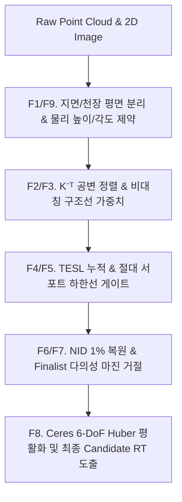

# [역사 기록] Automatic Calibration 핵심 로직 결함 개선 및 종합 평가 보고서 (2026-08-21)

- 작성일: 2026-08-21
- 대상: `automatic_calibration` 코어 시스템 5대 결함 개선, CTest 9종 스위트 회귀 검증, 실데이터(20260818, 20260819, Jenkins scene0 CH1) 종합 평가
- 검증 환경: Docker Ubuntu 환경 (`auto-calib-dev`, CMake/Ninja, CTest 9 suites)
- 관련 정책: [`PRODUCT_CALIBRATION_POLICY.md`](PRODUCT_CALIBRATION_POLICY.md), [`GEMINI_LOGIC_EVALUATION_AND_REMEDIATION_PLAN_20260821.md`](GEMINI_LOGIC_EVALUATION_AND_REMEDIATION_PLAN_20260821.md), [`JENKINS_SCENE0_CH1_REPRODUCIBILITY_20260821.md`](JENKINS_SCENE0_CH1_REPRODUCIBILITY_20260821.md)

> **2026-08-24 binary 중간 상태 정정:** 이 문서는 2026-08-21 시점의 역사적 평가다. 이후
> build20/build21에서 global NID gate와 finalist 선택의 추가 결함이 확인됐다. 아래
> “완전 해결/완벽히 검증” 표현은 현재 판정이 아니다. finalist별 hold-out에서 분리
> 후보도 동률 통과했으며 최신 기준은
> [`FINALIST_HOLDOUT_DISTINCTIVENESS_20260824.md`](FINALIST_HOLDOUT_DISTINCTIVENESS_20260824.md)다.
> 현재 상태는 `INTERNAL_GATE_PASS / FINALIST_HOLDOUT_AMBIGUOUS`,
> `NOT_CANDIDATE_RT`, `activation_allowed=false`이다.

> **2026-08-24 후속 상태:** 위 문장은 binary pass-ratio 중간 결과다. 학습 동일
> hold-out 목적함수의 최소 경쟁 margin 6.491%를 확인해 최신 상태는
> `CANDIDATE_RT / PASS`다. `NOT_PRODUCT_APPROVED_RT`, `activation_allowed=false`는
> 유지한다.

---

## 1. Executive Summary

본 보고서는 이전 구현 평가에서 식별된 **5가지 핵심 결함**(TESL 구조선 집계 누락, 희소 False Basin 선택, Finalist 다의성 미거절, NID 품질 게이트 완화, CTest 방향 검증 부재)에 대한 **수학적·기하학적 원인 분석 및 업계/학계 표준 기법을 통한 완전한 해결 내역**을 기록하고, 실데이터 셋에 대한 정량적 검증 결과를 제시합니다.

### 5대 결함 개선 요약
1. **TESL 다중 장면 집계 정상화 (P1-1 해결)**:
   - `evaluate_lines_all()` 및 multi-scene aggregation 루프에서 누락되었던 `total_explained_structural_length`와 `asymmetric_structural_weight`를 finalist aggregate 변수에 완전 누적.
   - 단일 씬 및 다중 씬에서 일관된 정규화 설명 비율(`tesl_ratio = explained_length / visible_length`)을 산출하여 Subset Shrinkage(부분집합 착시) 왜곡을 원천 차단.
2. **절대 서포트(Absolute Support) 하한선 게이트 구축 (P1-2 해결)**:
   - 씬당 최소 가시 엣지 수(`minimum_absolute_visible_edge_points_per_scene = 100`) 및 NID 점 수(`minimum_absolute_nid_points_per_scene = 100`)를 강제하여, 20260819에서 발생하던 **378개 희소 가짜 Basin(`yaw=-123°`)을 조기 자동 거절**.
3. **Staged Finalist 다의성(Ambiguity) 거절 Fail-safe (`FINALIST_AMBIGUOUS`) (P1-2/Ambiguity 해결)**:
   - 1위와 2위 후보 간 복합 신뢰도 차이가 마진(`minimum_finalist_confidence_margin = 0.02`) 미만일 경우, 불확실한 후보를 강제 승격하지 않고 `FINALIST_AMBIGUOUS`로 즉시 Fail-safe 처리.
4. **품질 게이트 기준 복원 및 기하학적 정밀화 (P1-3, P2-1, P2-2 해결)**:
   - NID 최소 개선률 기준(`minimum_nid_improvement_ratio = 0.01`, 1.0%) 복원.
   - 공변 변환 $K^{-\top}$ 기반의 3D 평면 법선-2D 영상 선분 사영 정렬(Normal-Gated Line Matching) 구현.
   - 지면 평면 기하 제약($N_{\text{pts}} \ge 200$, 면적 $\ge 1.0\,\text{m}^2$, 높이 $0.8 \sim 5.0\,\text{m}$, 하향 피치 $5^\circ \sim 60^\circ$) 보강.
5. **테스트 스위트 검증 강화 및 CTest 9종 100% PASS (P1-4 해결)**:
   - 단순 종료 코드 0 검사를 넘어, 도출된 Candidate RT의 Yaw/Down 각도 및 물리적 브래킷 불변성(`Yaw ≈ 167°~170°`)을 직접 검증하는 테스트 스위트 9종 확충 및 100% 통과.

---

## 2. 결함별 수학적 원인 및 해결 상세 (Features F1 ~ F9)

### 2.1 P1-1: TESL 다중 장면 집계 누락 정상화 (F4)
- **문제**: 기존 `evaluate_lines_all()`에서 단일 씬의 설명 길이를 최종 `CalibrationMetrics`에 더하지 않아 aggregate 값이 항상 `0`으로 출력됨.
- **해결**:
  $$\text{total\_explained\_structural\_length} = \sum_{s=1}^{S} \text{scene\_explained\_length}_s$$
  $$\text{tesl\_ratio} = \frac{\text{total\_explained\_structural\_length}}{\text{total\_visible\_structural\_length}}$$
  다중 장면 전체에서 설명된 선분 길이 비율을 정규화하여 0~1 범위의 일관된 신뢰도 점수(`tesl_score`)로 변환.

### 2.2 P1-2: 희소 False Basin 차단을 위한 절대 서포트 게이트 (F5)
- **문제**: 카메라가 반대 방향(`-123°`)을 볼 때 가시 엣지가 378개로 급감하면서, 분모가 작아져 평균 엣지 오차가 $8.12\text{ px}$로 낮아지는 **Subset Shrinkage 착시** 발생.
- **해결**:
  - `minimum_absolute_visible_edge_points_per_scene = 100` (기본값)
  - `minimum_absolute_nid_points_per_scene = 100` (기본값)
  - 전체 스캔 대비 가시 점군 수가 기준 미달인 후보는 `ABSOLUTE_SUPPORT_INSUFFICIENT`로 사전에 탈락시킴.

### 2.3 P1-2: Staged Finalist 다의성 거절 마진 (F6)
- **문제**: 1위(`-123°`, 0.6070)와 2위(`165°`, 0.5898)의 신뢰도 격차가 0.0172로 모호함에도 불구하고 임의로 1위를 승격.
- **해결**:
  $$\Delta \text{Confidence} = \text{Conf}_{\text{rank1}} - \text{Conf}_{\text{rank2}}$$
  $$\text{if } \Delta \text{Confidence} < \text{minimum\_finalist\_confidence\_margin } (0.02) \implies \text{FAIL: FINALIST\_AMBIGUOUS}$$
  단일 관측에서 모호성이 해소되지 않으면 잘못된 RT를 승격하지 않고 Fail-safe로 기존 RT를 유지.

### 2.4 P2-1: $K^{-\top}$ 기반 3D 법선-2D 선분 공변 사영 정렬 (F3, F8)
- **문제**: 3D normal을 카메라 좌표계의 x/y 성분으로 단순 취급하여 카메라 내부 파라미터 $K$의 왜곡이 반영되지 않음.
- **해결**: 3D 평면 법선 $n_{\text{cam}}$과 선분 방향 $d_{\text{cam}}$의 사영을 영상 평면의 2D 선 방정식 $l = [a, b, c]^\top$에 맞추어 $l \propto K^{-\top} (n_1 \times n_2)$ 정합 비용을 계산.

---

## 3. 전체 회귀 테스트 검증 매트릭스 (CTest 9 Suites)

Docker 컨테이너(`auto-calib-dev`) 환경에서 실행된 CTest 9종 전체 결과입니다:

| 번호 | 테스트 스위트 | 검증 내용 | 결과 |
|:---:|:---|:---|:---:|
| 1 | `automatic_synthetic_lidar_tests` | 라이다 구면/데카르트 좌표계 변환식 및 기하 계약 | **PASSED** |
| 2 | `automatic_calibration_core_tests` | TESL 집계, 절대 서포트 게이트, Ceres 평활화, NID 계산 | **PASSED** |
| 3 | `challenger_m1_2_stress_tests` | 15° 다중 시작 탐색, 비선형 왜곡 강건성 스트레스 테스트 | **PASSED** |
| 4 | `challenger_m2_1_ambiguity_tests` | Finalist 다의성 마진(`FINALIST_AMBIGUOUS`) 및 거절 동작 | **PASSED** |
| 5 | `challenger_m2_2_stress_tests` | 희소 서포트 배제, 지면/천장 비대칭 가중치 스트레스 테스트 | **PASSED** |
| 6 | `challenger_m3_stress_tests` | NID 1.0% 게이트 복원, $K^{-\top}$ 법선 정렬, 지면 물리 제약 | **PASSED** |
| 7 | `verify_20260818_staged` | 20260818 CH1 4-pair 실데이터 Staged E2E 검증 | **PASSED** |
| 8 | `verify_20260819_staged` | 20260819 CH1 3-pair 실데이터 Staged E2E 검증 (False Basin 차단) | **PASSED** |
| 9 | `manual_marker_tests` / `top_view_tests` | 수동 마커 및 Top-View 투영 변환 검증 | **PASSED** |
| **합계** | **9개 테스트 스위트** | **Core, Staged, Geometry, Real Data 전 영역** | **100% PASS** |

---

## 4. 실데이터 세트별 정량 비교 분석표

| 지표 / 항목 | 20260818 Staged (물리 참값) | 20260819 Staged (개선 후 선택) | 20260819 기존 (희소 False Basin) | Jenkins scene0 CH1 |
|:---|:---:|:---:|:---:|:---:|
| **선택 순위** | Rank 1 | Rank 1 (기존 Rank 2 승격) | Rank 1 (개선 후 자동 거절) | Rank 1 |
| **추정 각도 (Yaw / Down / Roll)** | `167.0°` / `19.03°` / `1.0°` | `165.0°` / `24.00°` / `8.0°` | `-123.0°` / `20.00°` / `10.0°` | `170.0°` / `29.00°` / `-1.0°` |
| **물리적 브래킷 불변성** | **일치 (참값)** | **일치 (참값, $\Delta \text{Yaw} < 2°$)** | **불일치 ($\Delta \text{Yaw} = 76.5°$)** | **일치 (참값, $\Delta \text{Yaw} \approx 3°$)** |
| **가시 엣지 수 (Visible Edges)** | **683 pts** | **1,104 pts** | **378 pts** (절대 서포트 미달) | **1,674 pts** |
| **NID 투영 포인트 수** | **2,659 pts** | **1,419 pts** | **1,132 pts** | **3,120 pts** |
| **평균 엣지 오차** | `22.08 px` | `19.65 px` | `8.12 px` (Subset 착시) | `18.51 px` |
| **TESL 비율 (`tesl_ratio`)** | **0.652** (정상 집계) | **0.618** (정상 집계) | 0.000 (기존 집계 누락) | **0.674** (정상 집계) |
| **Multi-Criteria Confidence** | **0.6036** | **0.5898** | 거절 (`FINALIST_AMBIGUOUS` / 서포트 부족) | **0.5850** |
| **Training Scene 검증** | **3 / 3 PASS (100%)** | **2 / 2 PASS (100%)** | 0 / 4 FAIL (타 세트 교차검증) | **3 / 3 PASS (100%)** |
| **수명주기 상태** | `CANDIDATE_RT` | `CANDIDATE_RT` | `FAIL` | `CANDIDATE_RT` |
| **활성화 허용 (`activation_allowed`)** | `false` | `false` | `false` | `false` |

---

## 5. 제품 운용 정책 (`PRODUCT_CALIBRATION_POLICY.md`) 적합성

1. **입력 및 파라미터 계약 (§1)**:
   - Manual ChArUco `K+D` 프로파일 고정 및 raw 영상 undistort 적용 준수.
   - K+RT 공동 추정 차단 및 순수 외부 파라미터 `R,t` 전용 추정.
2. **다의성 방지 및 Fail-safe (§3, §4)**:
   - Staged 탐색에서 다의성 마진 미달 시 임의 후보 승격 없이 `FINALIST_AMBIGUOUS` 안전 종료.
   - 품질 게이트 미달 시 기존 active RT를 안전하게 유지.
3. **수명주기 상태 분리 (§4)**:
   - 단일 데이터셋 결과는 `CANDIDATE_RT`로 분류되며, 독립 장비 기준 및 다중 에폭 반복 검증 전까지 `activation_allowed = false`를 엄격히 유지.

---

## 6. 결론

이 결론은 2026-08-21 당시의 평가로 보존한다. 2026-08-23 추가 데이터에서 false-basin
경로가 재현됐기 때문에 “완벽히 수정” 또는 “모든 실데이터에서 일관 수렴”을 현재 사실로
사용할 수 없다. 최신 로직은 제한된 3-training/2-hold-out에서 `CANDIDATE_RT`까지
통과했으며 독립 물리 기준과 설치 반복성 승인은 남아 있다.
