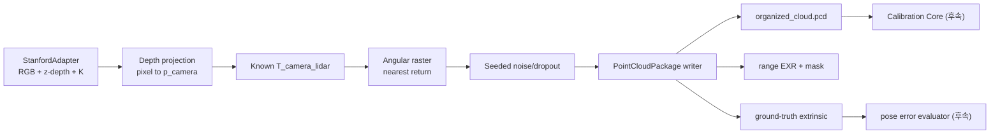
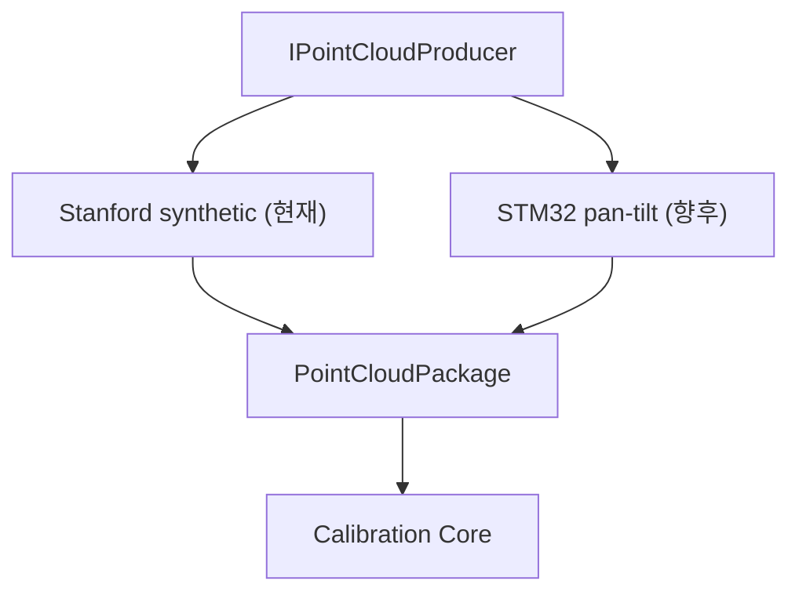

# Stanford 2D-3D-S 기반 합성 LiDAR 테스트 아키텍처

## 1. 목적과 경계

실제 1D LiDAR pan-tilt actuator 완성 전까지 Calibration Core의 입력 계약, 좌표변환, organized topology와 재현성을 개발하기 위한 가상 센서 producer다. OpenSDK/CV5, TOFSense 물성 및 actuator 동역학 검증은 범위 밖이다. 실장 후 producer만 교체하고 `PointCloudPackage`와 Calibration Core는 유지한다.

## 2. 데이터 흐름



| 컴포넌트 | 책임 | 실장 후 |
|---|---|---|
| Stanford adapter | 대응 RGB/depth/pose 탐색, K 로드 | 제거 |
| Virtual scanner | pan/tilt grid, first return, noise | STM32/Pi producer로 교체 |
| Package writer | 공통 schema와 provenance | 재사용 가능 |
| Calibration Core | 입력 검증, 특징, 최적화 | 변경 없음 |

## 3. 좌표와 depth 규약

카메라 optical 및 가상 `lidar_scan`은 `+X` 오른쪽, `+Y` 아래, `+Z` 전방이다. pan은 `atan2(X,Z)`로 오른쪽이 양수, tilt는 `atan2(-Y,sqrt(X²+Z²))`로 위쪽이 양수다.

Ground truth는 child-to-parent 규약이다.

```text
p_camera = R_camera_lidar * p_lidar + t_camera_lidar
```

Stanford perspective depth는 radial range가 아니라 z-depth이며 다음과 같이 복원한다.

```text
z = raw / 512 [m]
x = (u-cx) * z / fx
y = (v-cy) * z / fy
```

`raw=65535`와 `raw=0`은 결측이다. `pano/depth`는 radial distance이므로 이 adapter 입력으로 쓰지 않는다.

## 4. Scan 모델

카메라 3D 점을 `lidar_scan`으로 변환해 pan/tilt cell로 양자화한다. 동일 cell의 여러 점 중 range가 가장 작은 점을 1D LiDAR first return으로 선택한다. 각도 범위, rows/columns, pixel stride, range 한계, Gaussian range noise, dropout, seed와 6-DoF ground truth를 CLI에서 설정한다. 동일 입력과 seed는 동일 field 값을 만든다.

## 5. 출력 계약

```text
generated/<session>/
  manifest.yaml
  camera/rgb.png
  calibration/ground_truth_extrinsic.json
  cloud/organized_cloud.pcd
  cloud/range_image.exr
  cloud/validity_mask.png
  qa/pointcloud_quality.json
```

PCD는 invalid cell을 NaN으로 보존하고 `WIDTH * HEIGHT`가 전체 angular grid와 일치한다. 합성 점은 `VALID_RANGE | SYNTHETIC_MEASUREMENT` flag를 가진다.

## 6. 테스트 전략

현재 자동 테스트:

1. depth `1024 -> 2 m` 변환과 결측 처리
2. `T_camera_lidar` 왕복 변환
3. organized grid row/column 보존
4. 동일 ray의 nearest-return 선택
5. 실제 `area_1` package 생성 smoke test

Calibration Core 구현 후 추가:

1. ground truth에서 reprojection residual 최소 확인
2. 알려진 pose perturbation 복원
3. seed별 noise/dropout Monte Carlo
4. overlap 부족과 blank-wall rejection
5. multi-scene joint optimization
6. translation/rotation 오차와 convergence basin 보고

## 7. 한계

현재는 단일 perspective camera에 보인 geometry만 사용하므로 독립 LiDAR의 비중첩 영역을 완전히 재현하지 않는다. signal strength, multi-path, saturation, range bias, encoder quantization/backlash, timestamp drift, sweep distortion과 진동도 없다. 따라서 결과는 알고리즘 회귀 테스트이며 실제 센서 정확도 평가가 아니다.

더 높은 충실도가 필요하면 `3d/rgb.obj`에 독립된 가상 LiDAR origin에서 raycasting하는 `MeshRaycastProducer`를 추가한다. 이 확장도 동일한 `Scan`/package 출력 인터페이스를 구현해야 한다.

## 8. 실제 장비 전환



실장 전환 시 actuator protocol을 Calibration Core에 노출하지 않는다. 실제 producer가 timestamp, encoder interpolation, signal quality 및 kinematics를 책임지고 같은 package schema를 생성한다.
