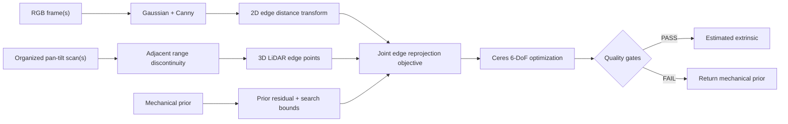

# Calibration Core 아키텍처 및 검증 가이드

## 1. 구현 상태

현재 구현은 Ubuntu native 개발 환경에서 동작하는 **Calibration Core MVP**다.
Stanford 2D-3D-Semantics의 RGB/depth로 생성한 가상 pan-tilt LiDAR scan을 입력으로 사용하며,
카메라와 LiDAR 사이의 6-DoF 외부 파라미터를 추정한다.

- 단일 장면 API와 다중 장면 공동 최적화 API 구현
- RGB Canny edge와 organized LiDAR range discontinuity edge 추출
- Ceres 기반 angle-axis 6-DoF 최적화
- 기계 설계값(mechanical prior) 정규화
- 입력 품질, 중첩률, 목적함수, 이동량 품질 게이트
- 불합격 후보를 외부로 내보내지 않고 입력 prior를 반환하는 fail-safe 계약
- 합성 ground truth를 이용한 conformance CLI 및 JSON 결과

OpenSDK/CV5 이식과 실제 actuator 데이터 취득은 이 구현 범위에 포함하지 않는다.

## 2. 좌표계 계약

외부 파라미터는 다음 식으로 고정한다.

```text
p_camera = R_camera_lidar * p_lidar + t_camera_lidar
```

- 거리 단위: meter
- 각도 내부 단위: radian
- 보고서 회전 오차: degree
- 카메라 좌표: OpenCV optical frame (`+x` right, `+y` down, `+z` forward)
- LiDAR 점은 actuator의 pan/tilt 광선에 따라 organized scan으로 저장

좌표계 방향이나 parent/child frame을 바꾸면 결과가 수치상 정상처럼 보여도 반대 변환이 된다.
실장 연동 시 이 계약을 adapter 경계에서 반드시 확인한다.

## 3. 처리 흐름



### RGB feature

1. 1채널 또는 BGR 영상을 grayscale로 변환한다.
2. Gaussian blur 후 Canny edge를 계산한다.
3. edge까지의 거리 영상을 `cv::distanceTransform`으로 만든다.

### LiDAR feature

organized scan의 수평·수직 이웃 range 차이를 확인한다.
절대 threshold와 가까운 range에 비례한 상대 threshold 중 큰 값을 사용한다.
불연속을 이루는 양쪽 점을 모두 3D edge 후보로 선택한다.

### 목적함수

각 LiDAR edge를 후보 외부 파라미터로 카메라에 투영하고 2D distance transform 값을
잔차로 사용한다. 장면 수나 edge 수에 따라 prior 영향이 달라지지 않도록 전체 edge 수의
제곱근으로 데이터 잔차를 정규화한다. 큰 영상 거리의 영향은 `residual_cap_px`로 제한한다.
회전·평행이동 prior sigma는 서로 독립적으로 설정한다.

Stanford 검증에서 회전은 영상 edge로 개선됐지만 평행이동 관측성은 상대적으로 약했다.
따라서 기본 평행이동 prior sigma는 2cm로 설정했다. 실제 장비에서는 기구 공차와 반복 측정
결과로 이 값을 다시 정해야 한다.

## 4. 공개 API

헤더: `include/auto_calib/calibration_core.hpp`

```cpp
auto result = auto_calib::calibrateExtrinsic(
    bgr, camera, scan, mechanical_prior, config);
```

단일 장면의 빠른 진단용 API다. 텍스처가 많은 장면에서는 잘못된 edge 최소점이 생길 수
있으므로 최종 보정값 산출에는 다중 장면 API를 권장한다.

```cpp
std::vector<auto_calib::CalibrationObservation> observations;
// 서로 다른 구조와 시점을 가진 RGB + organized scan을 추가한다.
auto result = auto_calib::calibrateExtrinsicMultiScene(
    observations, mechanical_prior, config);
```

모든 장면에서 동일한 외부 파라미터 하나를 공동 최적화한다. 실제 시스템에서는 센서가
강체로 고정된 상태에서 서로 다른 벽, 문틀, 가구 경계를 포함한 장면 5개 이상을 사용한다.

주요 결과 필드는 다음과 같다.

| 필드 | 의미 |
|---|---|
| `success` | Core 품질 게이트 통과 여부 |
| `reason_code` | `PASS` 또는 거절 원인 |
| `estimated_t_camera_lidar` | 통과 시 후보, 실패 시 입력 mechanical prior |
| `metrics.projected_ratio` | 전체 LiDAR edge 중 영상에 유효 투영된 비율 |
| `metrics.initial_mean_edge_distance_px` | prior에서의 평균 edge 거리 |
| `metrics.final_mean_edge_distance_px` | 최적화 후보에서의 평균 edge 거리 |
| `solver_summary` | Ceres 종료 요약 |

## 5. Fail-safe 및 품질 게이트

아래 조건 중 하나라도 만족하지 못하면 `success=false`다.

- 유효한 camera intrinsic
- 최소 camera edge 수
- 장면별 최소 LiDAR edge 수
- 최소 영상 투영 중첩률
- 최대 평균 edge 거리
- 초기값 대비 목적함수 비악화
- prior 대비 최대 회전/평행이동 허용량
- Ceres가 사용할 수 있는 해를 생성하고 `CONVERGENCE`로 종료

실패한 최적화 후보는 `estimated_t_camera_lidar`에 저장하지 않는다. 호출자는 실패 시에도
잘못된 보정값을 actuator나 후단 perception에 적용하지 않고 기존 mechanical prior를
계속 사용할 수 있다.

합성 CLI의 `status`는 Core 성공뿐 아니라 ground-truth 허용오차까지 통과해야 `PASS`다.
`core_status=PASS`, `status=FAIL`이면 수학적 최적화는 끝났지만 정확도 규격은 충족하지
못했다는 뜻이다.

## 6. 빌드와 테스트

`develop` 폴더에서 실행한다.

```bash
docker compose exec -T dev cmake \
  -S /workspace -B /workspace-build -G Ninja \
  -DCMAKE_BUILD_TYPE=RelWithDebInfo
docker compose exec -T dev cmake --build /workspace-build --parallel 2
docker compose exec -T dev ctest \
  --test-dir /workspace-build --output-on-failure
```

현재 단위 테스트는 다음을 검증한다.

- synthetic pan-tilt scan 생성과 재현성
- LiDAR range edge 추출
- 단일 장면 최적화
- 다중 장면 공동 최적화
- blank RGB 입력 거절
- 과도한 후보 이동 거절 및 prior fallback
- pose error 계산

## 7. Stanford 다중 장면 conformance 실행

아래 명령은 서로 다른 공간 5개를 사용한다.

```bash
docker compose exec -T dev /workspace-build/run_multi_synthetic_calibration \
  --dataset-root /datasets/stanford2d3ds/area_1 \
  --output /workspace/generated/calibration_core_multi_validation \
  --frame-ids \
camera_0004591bfdc749a88db196a5d8b345cb_office_6_frame_0,camera_00d10d86db1e435081a837ced388375f_office_24_frame_0,camera_03eb3fa2e1524ee887ba22d1a4896f3c_WC_1_frame_0,camera_042a479869b44a7c9159922f19a285ea_conferenceRoom_1_frame_0,camera_042fab82b3a94af9bea3c80984bc2583_hallway_2_frame_0
```

2026-07-27 검증 결과:

| 항목 | 결과 |
|---|---:|
| 장면 수 | 5 |
| 초기 회전 오차 | 2.7533° |
| 최종 회전 오차 | 0.7895° |
| 초기 평행이동 오차 | 0.03536m |
| 최종 평행이동 오차 | 0.03930m |
| 허용오차 | 회전 3.0°, 평행이동 0.05m |
| 전체 LiDAR edge | 5,871 |
| projected ratio | 0.6866 |
| runtime | 621.1ms |
| conformance | PASS |

결과 JSON은
`generated/calibration_core_multi_validation/calibration_result.json`에 생성된다.

단일 장면 기본 검증은 회전 오차는 줄였지만 평행이동 오차가 0.06166m여서 정답 허용오차
0.05m를 넘었고 `GROUND_TRUTH_TOLERANCE_EXCEEDED`로 정상적으로 실패한다. 이 결과 때문에
단일 장면은 최종 보정 경로가 아니라 입력/기능 smoke test로 분류한다.

## 8. 실제 actuator 연결 시 adapter 경계

Core는 데이터 취득 장치와 분리되어 있다. 실제 actuator가 완성되면 합성 생성기만 아래
adapter로 교체하고 Core API는 유지한다.

1. pan/tilt encoder 각도와 1D LiDAR range를 `Scan`의 row/column 순서로 변환
2. 카메라 timestamp와 scan sweep 기준 timestamp 동기화
3. invalid range, saturation, actuator 정지/가속 구간을 quality flag로 제거
4. 카메라 intrinsic과 distortion 보정 영상을 Core에 전달
5. 최소 5개의 서로 다른 장면을 모아 `calibrateExtrinsicMultiScene` 호출
6. `success=true`와 현장 정확도 검증을 모두 통과한 경우에만 보정값 저장

## 9. 현재 한계와 완료 조건

현재 Core는 합성 conformance 개발과 API 통합을 진행할 수 있는 MVP이며, 양산 완료 상태는
아니다. 다음 항목이 실제 장비에서 확인되어야 Calibration Core production 완료로 판정한다.

- 실제 actuator의 encoder/range 시간 동기화
- 카메라 distortion 및 rolling-shutter 영향 반영
- 기구 공차 기반 prior sigma 재산정
- 장면 자동 선별과 관측성/퇴화 판정
- 실제 target 또는 측량 ground truth 정확도 검증
- 반복 측정 분산, 온도 변화, 진동에 대한 weekly endurance 검증
- OpenSDK/CV5 adapter 및 성능 검증(사용자 진행 범위)

## 10. 코드 맵

| 파일 | 역할 |
|---|---|
| `include/auto_calib/calibration_core.hpp` | 설정, 결과, 단일/다중 공개 API |
| `src/calibration_core.cpp` | feature 추출, Ceres 최적화, 품질 게이트 |
| `apps/run_synthetic_calibration.cpp` | 단일 Stanford 합성 conformance CLI |
| `apps/run_multi_synthetic_calibration.cpp` | 다중 Stanford 합성 conformance CLI |
| `tests/calibration_core_tests.cpp` | Core 단위 및 fail-safe 회귀 테스트 |
| `generated/.../calibration_result.json` | 실행별 machine-readable 결과 |
