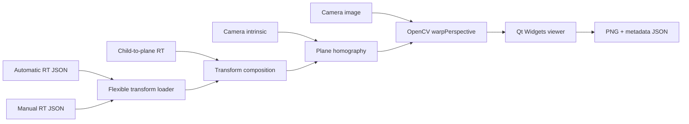

# Top-View GUI Architecture

## 모듈 경계



`top_view_core`는 Qt에 의존하지 않는다. JSON parsing, frame 검증, transform 합성,
homography와 image rendering을 담당한다. `calibration_top_view_gui`만 Qt Widgets에
의존한다. 따라서 이후 Open Platform adapter나 headless renderer도 같은 core를
재사용할 수 있다.

## Frame 계약

Calibration RT가 `T_camera_child`, plane RT가 `T_child_plane`이면 다음을 계산한다.

```text
T_camera_plane = T_camera_child * T_child_plane
```

두 transform의 middle frame 이름이 다르면 렌더링을 거부한다. Plane 좌표는 `X/Y`
평면이고 `Z=0`이며 출력 영상에서는 +X가 오른쪽, +Y가 위쪽이다.

## Homography

Plane point `[X,Y,0,1]`에 대해 다음 homography를 사용한다.

```text
H_image_plane = K [r1 r2 t]
H_image_map = H_image_plane H_plane_map
```

`warpPerspective`에는 destination map pixel에서 source camera pixel로 가는
`H_image_map`과 `WARP_INVERSE_MAP`을 사용한다.

## 안전한 실패

- Camera K 또는 해상도가 없으면 거부
- 영상과 intrinsic 해상도가 다르면 기본 거부
- Rotation이 orthonormal하지 않으면 거부
- RT frame chain이 연결되지 않으면 거부
- Singular homography와 과도한 출력 크기를 거부
- Plane RT 생략 시 UI와 metadata에 assumed plane 경고 기록
